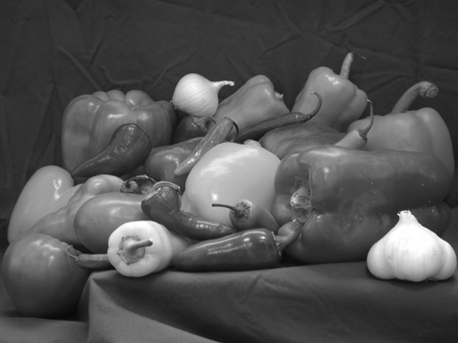
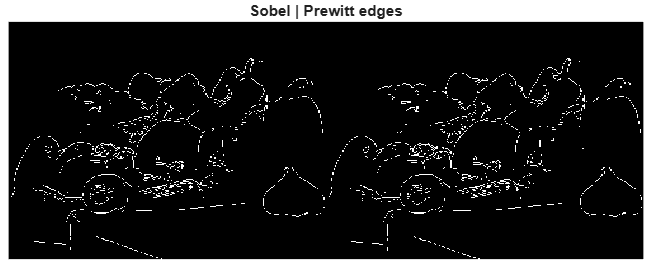
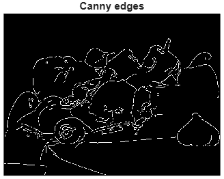
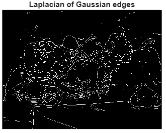
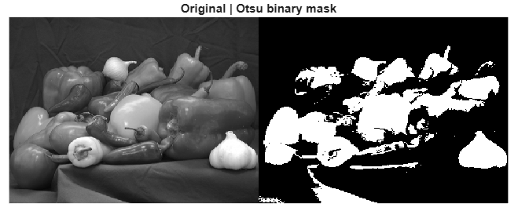
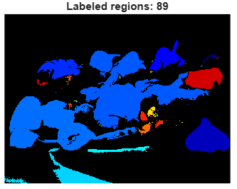

# Lab 5 – Edge Detection & Segmentation  

**MATLAB implementation** of the classic edge detectors, Otsu thresholding, and region labeling on the `peppers.png` image.

---

## Results (screenshots)

| Step | Description | Image |
|------|-------------|-------|
| 0 | Original grayscale image |  |
| 1 | **Sobel** (left) **Prewitt** (right) | |
| 2 | **Canny** detector (`[0.05 0.2]`) |  |
| 3 | **Laplacian of Gaussian** (LoG) |  |
| 4 | **Otsu** binary mask |  |
| 5 | **Connected-component labeling** (`bwlabel`) |  |

---

## 1. Basic derivative filters  

* **Sobel** and **Prewitt** compute first-order gradients with 3×3 kernels.  
* They respond to **high-frequency** intensity changes → edges appear where the gradient magnitude is large.  

---

## 2. Canny detector  

* Multi-stage pipeline:  
  1. Gaussian smoothing  
  2. Gradient computation (Sobel)  
  3. Non-maximum suppression → **thins** edges  
  4. Double thresholding + hysteresis → removes noise while keeping continuity  

---

## 3. Laplacian of Gaussian (LoG)  

* Second-order derivative → zero-crossings mark edges.  
* Gaussian pre-filter reduces noise sensitivity.  

---

## 4. Otsu thresholding  

```matlab
level = graythresh(I);   % automatic
BW    = imbinarize(I,level);
